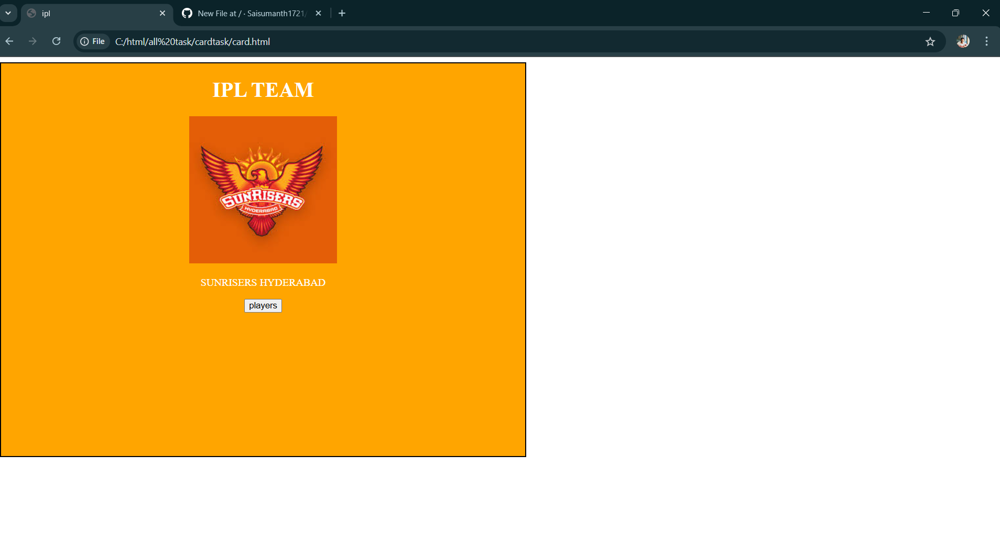
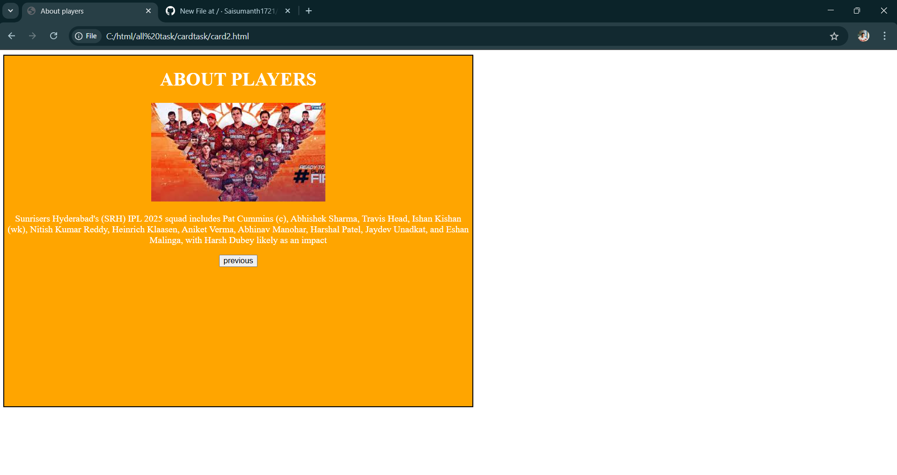

# HTML Card Tasks

This repository contains simple and responsive HTML card designs created for practice.

## Files

- card.html – Basic card layout
- card2.html – Another card layout
- card.css – CSS for styling the cards

## Features

- Clean and simple HTML structure
- External CSS styling
- Responsive layout (mobile-friendly)

## How to View

Open the files in your browser:
- [card.html](./card.html)
- [card2.html](./card2.html)

## Screenshots

### Card 1 Preview

### Card 2 Preview

## Author

*Sai Sumanth RV*  
Email: saisumanth1721@gmail.com  
Location: Hyderabad, Telangana
